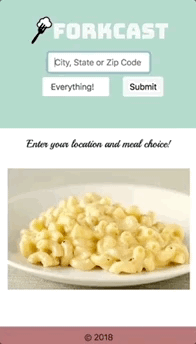
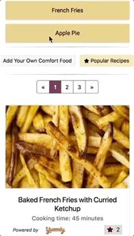
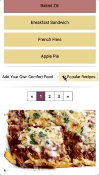
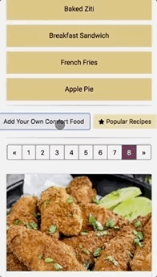

# Forkcast

*Find comfort foods to eat based on the weather*

[Check it out!](https://forkcastfoods.github.io)

### Table of Contents

[Concept](#concept) 
[Motivation](#motivation) 
[Development Process and Design](#development-process-and-design) 
[App Demo](#app-demo) 
[Directions for Future Development](#directions-for-future-development)

---

## Concept

The *Forkcast* app allows users to find comfort foods to eat based on the weather at their location. Our extensive database of comfort foods includes breakfast, lunch, dinner, and snack options to please any user's palette. 

The user inputs their location based on city, state, or zip code, then selects what type of meal they want. Their location input is used to determine the weather for their area. The weather information is then used to select a few meal options from our database that match the weather conditions. The app suggests 5 meals, with 3 recipes for each meal suggestion. Recipes include a photo, a link to the full recipe, a list of ingredients, and cooking time. 

Users may also input their own comfort food, associated with certain weather conditions, to our database. 

## Motivation

The goal of *Forkcast* is to provide anyone, anywhere a quick and convenient way to get appealing food suggestions. By incorporating the weather into the calculation of what food is suggested, our app is able to recommend foods that feel appropriate and appetizing with respect to the temperature and outside conditions. As the database of comfort foods expands, users will have the added benefit of increased variety in the food suggestions - never again will they eat the same old boring meals! 

---

## Development Process and Design

Our development team ([Anthony S.](https://github.com/ats89), [James C.](https://github.com/Faolun), [Julia S.](https://github.com/julesanne493), and [Malvika P.](https://github.com/malvikapchari)) followed an *Agile Development* process flow. We started with our main concept, 

> As a user, I want food suggestions based on my location and weather.

We then broke it down into a series of smaller user stories, each with its associated tasks:

> As a user, I want to be able to input my location.
  * Create a form that captures user location input.
  * When user clicks submit, the location input is passed to a Bing API request.
  * The Bing API request returns longitude and latitude coordinates.

> As a user, I want to see the weather at my location.
  * Use the coordinates (from Bing API) as params for an Open Weather API request.
  * The Open Weather API request returns temperature and weather description data.
  * Display the weather data at user-specified location.

> As a user, I want food suggestions based on the weather
  * Create a database of foods to suggest - each food item must have associated weather data (temperature, weather condition). 
  * Use the weather data (from Open Weather API) and the foods from database to come up with a list of 5 suggested foods.
  * Display the food suggestions to the user.

Once these initial tasks were completed and we had a *minimally viable product*, we improved UI/UX and added additional user stories/features:

> As a user, I want to explore recipes associated with each food suggestion.

> As a user, I want to be able to add my own comfort food.

> As a user, I want to see the most popular recipes amongst all users.

The app was built over a 5-6 day time constraint, with daily stand-up meetings to keep everyone on the team informed of the latest developments and encourage collaboration. 

Tools used for project management and communication: Git / pull requests + reviews, Github project board and issues, Slack

---

## App Demo

The [app](https://forkcastfoods.github.io) is mobile responsive and also includes design features such as pagination for loaded recipes and form validation for adding comfort foods.

## Technologies Used

* **APIs**
  * [Open Weather Map](https://openweathermap.org/api): Provides us with temperature and main weather description (clear, clouds, raining, etc.) - these temperature and weather descriptors get matched with foods in our database.
  * [Bing Maps](https://msdn.microsoft.com/en-us/library/dd877180.aspx): Open Weather Map does not support “City, State” queries, so we needed an alternate way to fetch the weather when the user inputs their location this way. By running the location through Bing Maps, we can generate longitude and latitude coordinates for use in our Open Weather Map API function.
  * [Yummly](https://developer.yummly.com/): Large recipe database that provides us with everything we need to display recipes to the user (image, cooking time, ingredients, recipe link).
* **Firebase**: Storage of foods database and favorite counts for recipes.
* **JavaScript**
* **jQuery**, **AJAX**
* Bootstrap, CSS3, HTML5

---

## Directions for Future Development

* Expand database of foods
* Improve/tweak the logic behind how food, weather, and location are associated
* Error handling in the event APIs return undesirable results
* General UI/UX improvements
